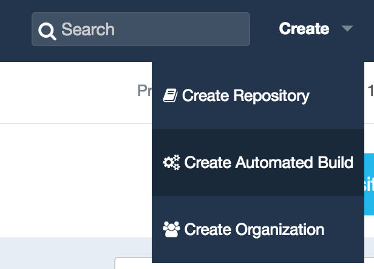
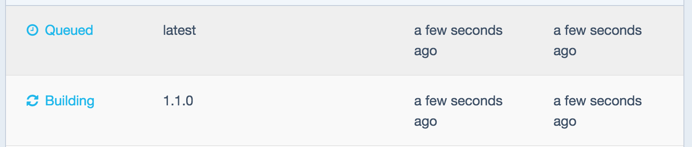
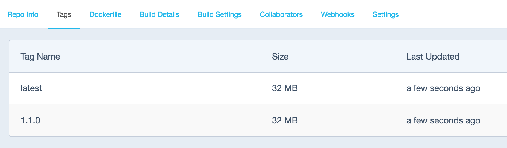

# Integrating Docker Hub in your application build process

This tutorial will be the first of a series helping you create continuous integration and deployment (CI/CD) pipelines for your applications.

CI/CD are vital in an Agile organization. We are goint to discover how the addition of Docker tools in our toolkit, can greatly improves application update, testing and shipping.

Depending on your ressources and constraints, there are of course multiple ways of achieving such a goal. We are going to start simple and discover the free tools that Docker made available to us.

You are going to create a Dockerfile for a simple web application, built it, get it to run locally, store it online and create your first automated build on Docker Hub.

## Requirements

- A valid account on Docker Hub
- A valid account on either Github or Bitbucket. Both platforms have free plans to get you started.
- Docker toolbox installed and running on your local machine.

## Create a local repo for your app

For this tutorial you will use a very simple Flask application, written in python, and create a production ready docker image.

Create a folder for your application code and initiate a git repo in it with:

    mkdir flask-demo-app
    cd flask-demo-app
    git init

Add the following code in a file named app.py:

```
from flask import Flask

app = Flask(__name__)
app.debug = True

@app.route('/')
def main():
    return 'Hi ! I\'m a Flask application.'

if __name__ == '__main__':
    app.run(host='0.0.0.0')
```

Docker helps us stay as much [DRY](https://en.wikipedia.org/wiki/Don%27t_repeat_yourself) as possible, buy giving us the ability to extend an already existing image. Here, I propose to use the image [jazzdd/alpine-flask](https://hub.docker.com/r/jazzdd/alpine-flask/), as it based on Alpine Linux, thus very lightweight.

Create a Dockerfile with the following content in it:

```
FROM jazzdd/alpine-flask
COPY . /app
```

Build your image locally:

    docker build -t demo .
    docker run -d --name app demo:latest

Test it by running curl in a temporary container with:

    docker run --rm --link app:app byrnedo/alpine-curl http://app

You should see in your terminal something like:

    Hi ! I'm a Flask application.

Stop and remove your container with:

    docker rm -vf app

Add and commit your files to your local repo:

    git add app.py Dockerfile
    git commit -a -m "Initial commit"

## Upload your repo online

Here, you can choose either Github or Bitbucket. Both are very well supported by Docker Hub.
In case it's the first time you're doing this, here are the links to their documentations:
- [Github](https://help.github.com/articles/creating-a-new-repository/)
- [bitbucket](https://confluence.atlassian.com/bitbucket/create-a-git-repository-759857290.html)
Once this is done, upload your code on your platform of choice with:

    git remote add origin git@<github|bitbucket>.org:<your_id>/<your_project_name>.git    
    git push -u origin master

If you navigate through the web interface, you should now see the code of your application.

## Create an automated build on Docker Hub

In the top right part of your Docker Hub account web interface, click on the create automatic build button:  and follow the process, which is really self-explanatory.

As the [documentation](https://docs.docker.com/docker-hub/builds/) is not exactly up to date, you will need to trigger the first build manually by clicking on the Trigger button in the Build settings tab:


## Test your Build

Once you've created your automatic build and triggered its first run, you should now be able to test it with:

    docker run -d --name app -p 80:80 <your_docker_hub_id>/<your_project_name>:latest

Stop and remove this container, once you're done with it.

## Version tagging

One of the most interesting feature of the Hub is the ability to tag your docker images. This way you can easily differentiate between them and, in case of problem with a specific version, perform a role-back.

In most cases the default configuration should suffice. It is very well integrated with Github and Bitbucket repositories.

When using a specific git branch name, Docker Hub will create docker images with the matching tags.

Create a branch for a newer version of your code:

    git checkout -b 1.1.0

Modify your app.py code with:

```
def main():
    return 'Hi ! I\'m a Flask application in a Docker container.'
```

Upload your new branch:

    git push -u origin 1.1.0

See the new image being built:



A new tagged build is now available:



Run it with:

    docker run -d --name app -p 80:80 <your_docker_hub_id>/<your_project_name>:1.1.0

## Conclusion

Using Docker Hub to build your images each time the code is modified and pushed to repository has some limitations. As of today it will build your images maximum every 5 minutes. But it is certainly a very cheap way of doing so and should get most developers integrating good practices very early. Later on, you might want to look into hosting your own private docker registry, using base images of your making or even have your own building and pushing process for your images.
Next time, we will explore how to run unit tests using on our application.
